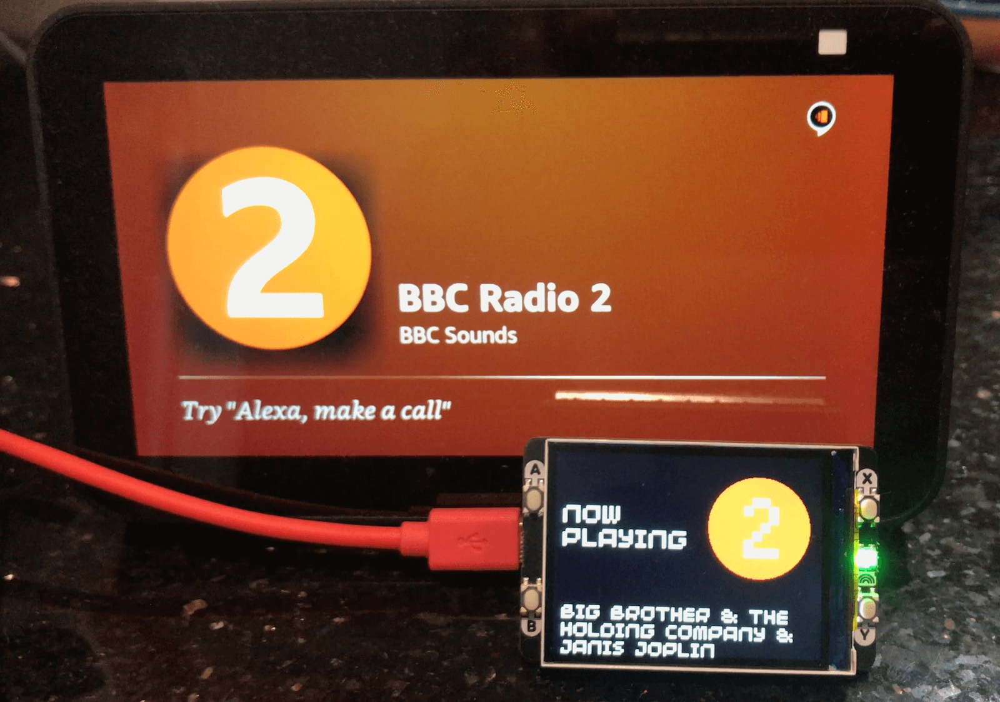
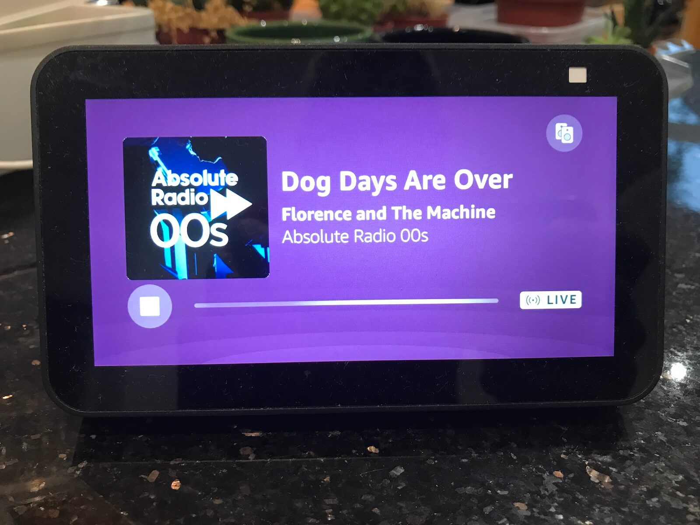
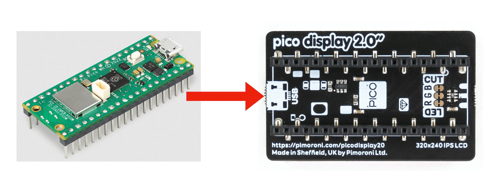

# BBC Radio "What's On" Display for Pimoroni Pico Display Pack 2


# Introduction

This is a small scale project that I made to solve a problem I had with our Amazon Echo Show device.

When using the [BBC Sounds skill](https://www.bbc.co.uk/sounds/help/questions/listening-on-a-smart-speaker/alexa) to play various BBC Radio stations I noticed that the current song and artist information isn't displayed.  The BBC has the data for this as it appears on the [web version of BBC Sounds](https://www.bbc.co.uk/sounds).

I decided to see how the website works, found the JSON feed with the information I needed and made my own companion display for the Echo Show...



If you're reading this and you're responsible for the BBC Sounds skill on Alexa I'd love to hear why you don't show this basic information (feel free to [get in touch](https://simonprickett.dev/contact/))... other skills can do it... here's Absolute Radio for example:



# Shopping List

You'll need the following to build and run this project... no soldering required!

## Hardware

Most of these links go to the Pimoroni shop in the UK (they also ship worldwide!).

* [Raspberry Pi Pico W](https://shop.pimoroni.com/products/raspberry-pi-pico-w?variant=40059369652307) (I recommend the version with the headers pre-soldered, if you want to do some soldering then pick up a Pico W without headers, get a set of headers and solder them on!)
* [Pimoroni Pico Display Pack 2.0](https://shop.pimoroni.com/products/pico-display-pack-2-0?variant=39374122582099).  A 320 x 240 pixel LCD display for Raspberry Pi Pico, with four buttons and an RGB LED.  This project uses all of these features.
* A [USB to micro USB data cable](https://shop.pimoroni.com/products/usb-a-to-microb-cable-red?variant=32065140746) (to provide power to the project and install code on the Pico W).  I like red cables but any colour and length will do so long as it provides both charging and data.
* A [USB plug](https://www.amazon.co.uk/TECHNOPLAY-Charger-Adapter-1000mAh-Compatible-White/dp/B09HDRYG7J/?th=1) if you want to power the project from a wall socket.  If you have one from a phone that you already own, that'll work fine.

## Software

This stuff's free! (but if you enjoy Thonny, please check out their "Support Ukraine" initiative [here](https://github.com/thonny/thonny/wiki/Support-Ukraine)).

* Pimoroni MicroPython runtime.  You'll want the latest build for the Raspberry Pi Pico W.  This contains the MicroPython runtime plus pre-installed libraries for Pimoroni products that the code depends on.  Download the latest `.uf2` file for the Pi Pico W from GitHub [here](https://github.com/pimoroni/pimoroni-pico/releases) (it will be named something like `pimoroni-picow-vX.XX.X-micropython.uf2`).  
* [Thonny IDE](https://thonny.org/) - a simple code editor that connects to the Raspberry Pi Pico W to install, run and debug code.  Alternative IDEs (for example Visual Studio Code with appropriate extensions) are available - if you're comfortable using one of those with the Raspberry Pi Pico W then go for it!

# Try it!

There's a few steps to complete before you can have this running on your hardware... they're not hard, let's take them one at a time...

## Assemble the Hardware

If you bought a Pi Pico W with the headers pre-soldered, then attaching the Display Pack is simply a matter of aligning the male headers on the Pico with the corresponding female ones on the Display pack and pushing the two together.

Pimoroni even print an image of the Pico on the underside of the Display Pack for you so that it's easy to see how to orient the Pico so that the micro USB port is at the right end of the Display Pack...



If you bought a Pico W without pre-soldered headers, you'll need to solder the headers on first.  If you need help with this I recommend watching [this video](https://www.youtube.com/watch?v=R11QanPDccs) on the "Learn Embedded Systems" channel on YouTube.

## Install Pimoroni MicroPython on the Raspberry Pi Pico W

The Raspberry Pi Pico W doesn't come with a MicroPython runtime installed by default.  Earlier, you downloaded the latest version of the Pi Pico W MicroPython image from Pimoroni.  You'll sometimes see this referred to as "Pirate Brand MicroPython".

We're using Pimoroni's distribution as it contains drivers for many of their products including the Display Pack 2 that we need for this project.

Install the MicroPython runtime by:

1. Holding down the BOOTSEL button on the back of the Pi Pico W whilst connecting it to your machine using the USB->Micro USB cable.
1. Dragging and dropping the `.uf2` file that you downloaded onto the removable drive named "RPI-RP2" that appears on your machine.
1. When the file copy has finished, the removable drive "RPI-RP2" should disappear, and you've now got a Pi Pico W running MicroPython.

If you get stuck or need a more detailed description of how to do this, check out Pimoroni's guide [here](https://learn.pimoroni.com/article/getting-started-with-pico#installing-the-custom-firmware).

## Get the Code

Grab a copy of the code by cloning it or downloading a zip of it from the GitHub repository ([here](https://github.com/simonprickett/pico-display-pack-2-radio-whats-on)).

If you have the `git` command line tools installed, clone the repository like this:

```
git clone https://github.com/simonprickett/pico-display-pack-2-radio-whats-on.git
```

This creates a folder named `pico-display-pack-2-radio-whats-on` wherever you ran the git clone command.  If you chose to download a zip file from GitHub insteead, unzip the file and you'll get the same folder.

Use Thonny or your own choice of IDE to open this folder.  

The next step is to configure the code to connect to your WiFi network.

## Network Configuration

You will need to add your WiFi SSID (network name) and password to the `src/secrets.py` file.  Edit `src/secrets.py` and replace the template content with the correct values for your network:

```python
WIFI_SSID = "Your wifi network name..."
WIFI_PASSWORD = "Your wifi password..."
```

Save your changes.

## Optional: Radio Station Configuration

This project displays "what's on" data for four BBC radio stations.  You change the current station displayed on the screen using the four buttons.  These are labelled A, B, X and Y.

The default configuration is as follows:

| Button | Station          |
|--------|------------------|
| A      | Radio 1          |
| B      | Radio 2          |
| X      | Radio 6 Music    |
| Y      | Radio Nottingham |

If you're just trying this out and are happy with these stations, skip the rest of this section.  If you'd like to change them for your own choices read on...

Here are some `id` values for a selection of national and local BBC radio stations.  

| Station                  | `id`                       |
|--------------------------|----------------------------|
| Radio 1                  | `bbc_radio_one`            |
| Radio 2                  | `bbc_radio_two`            |
| Radio 3                  | `bbc_radio_three`          |
| Radio 4                  | `bbc_radio_fourfm`         |
| Radio 5 Live             | `bbc_radio_five_live`      |
| Radio 6 Music            | `bbc_6music`               |
| Radio 1Xtra              | `bbc_1xtra`                |
| Asian Network            | `bbc_asian_network`        |
| World Service            | `bbc_world_service`        |
| Radio Scotland           | `bbc_radio_scotland_fm`    |
| Radio Wales              | `bbc_radio_wales_fm`       |
| Radio Ulster             | `bbc_radio_ulster`         |
| Radio Derby              | `bbc_radio_derby`          |
| Radio Leeds              | `bbc_radio_leeds`          |
| Radio Leicester          | `bbc_radio_leicester`      |
| Radio London             | `bbc_london`               |
| Radio Manchester         | `bbc_radio_manchester`     |
| Radio Merseyside         | `bbc_radio_merseyside`     |
| Radio Newcastle          | `bbc_radio_newcastle`      |
| Radio Nottingham         | `bbc_radio_nottingham`     |
| Radio Sheffield          | `bbc_radio_sheffield`      |
| Radio WM                 | `bbc_wm`                   |
| BBC Three Counties Radio | `bbc_three_counties_radio` |

If you don't see one that you're looking for here, it's easy to figure out the value you need.  Begin [here](https://www.bbc.co.uk/sounds/stations) at the BBC Sounds list of stations.  

Now click on the station that you want to get an ID for.  The value you need is the last part of the URL that your browser takes you to. 

For example if you wanted to add BBC Hereford and Worcester, the ID is `bbc_radio_hereford_worcester` taken from the URL `https://www.bbc.co.uk/sounds/play/live:bbc_radio_hereford_worcester`.

I'll leave the choice of pen colour and character to display for each station up to you.

Once you've chosen the stations that you want to assign to each button, edit `src/main.py`, changing the values here:

```python
STATION_MAP = {
    "a": {
        "id": "bbc_radio_one",
        "display": "1",
        "pen": display.create_pen(0, 0, 0),
        "outline": display.create_pen(128, 128, 128)
    },
    "b": {
        "id": "bbc_radio_two",
        "display": "2",
        "pen": display.create_pen(250, 100, 0)
    },
    "x": {
        "id": "bbc_6music",
        "display": "6",
        "pen": display.create_pen(1, 95, 13)
    },
    "y": {
        "id": "bbc_radio_nottingham",
        "display": "N",
        "pen": display.create_pen(32, 14, 51)
    }
}
```

The above is a Python dictionary which has top level keys "a", "b", "x", "y" - these are used to configure each button on the display.  Each button's key contains another dictionary that has keys as follows:

* `id` (required): The ID of the Radio station to get data for. 
* `display` (required): A single character to display as the station's logo (it will go in the centre of a circle on the display).  This will be rendered in white.
* `pen` (required): A [Pimoroni Pico Graphics](https://github.com/pimoroni/pimoroni-pico/tree/main/micropython/modules/picographics) pen used to draw and colour in the circular area on the screen.  Change the three numeric values (R, G, B) to represent the colour of your choice.  Here's an [RGB colour picker](https://www.rapidtables.com/web/color/RGB_Color.html) you can use.  In the example data, I've set the colours to match those used by the BBC for the respective radio stations.
* `outline` (optional): Another Pico Graphics pen.  This is optional and only needed when the colour you choose for `pen` can't easily be distinguished from the black background on the display.  If this value is present, the code will use this pen to draw an outline around the circle.  In the sample data set this is needed for Radio 1 as their brand colour is back.

You can also specify which of the four stations is the default one (loaded on startup without having to press a button).  Find this line of code:

```python
DEFAULT_STATION = "b"
```

And change the value to "a", "b", "x" or "y" according to your preference.

If you changed the button configurations and/or default station, save your changes to `src/main.py`.

## Copying the Code to the Raspberry Pi Pico W

You now need to get a copy of `src/main.py` and `src/secrets.py` onto the Pi Pico W.

Start Thonny.  Click the hamburger menu in the bottom right hand corner and select "MicroPython (Raspberry Pi Pico)" from the list of available runtimes.  From Thonny's "View" menu, ensure that "Files" is checked.

You should now see a "Raspberry Pi Pico" section in the file browser to the left in the Thonny window.

Shift click both `src/main.py` and `src/secrets.py` in the "Files" part of the file browser.  Now right click and select "Upload to /" from the menu that pops up.  This copies the files across to your Raspberry Pi Pico W.

## Running the Code

The code runs whenever the Raspberry Pi Pico W starts up.  Unplug the Pico from your machine, then plug it back in again or plug it into a USB wall power adapter.

You should see the device boot up, attempt to connect to the WiFi network and then display data for the default radio station.

If it doesn't work, reconnect the Pico to Thonny and make sure that the network credentials in `secrets.py` are correct.

# How Does it Work?

This isn't going to be a complete explanation of all of the code, it should be easy enough to follow (see `src/main.py`)... let's take a high level look at how we get the station information and then how it's displayed.

## Getting the Information

I found out that the track and artist information is available as a JSON feed by looking at the requests sent from the BBC Sounds page for Radio 2 ([here](https://www.bbc.co.uk/sounds/play/live:bbc_radio_two)).

Using Chrome's network inspector I found that this URL is requested periodically and contains the information we need:

```
https://rms.api.bbc.co.uk/v2/services/bbc_radio_two/segments/latest?experience=domestic&offset=0&limit=4
```

Using the station ID from the end of the page URL (e.g. `bbc_radio_two`) we can infer that swapping `bbc_radio_two` for another station's ID will get information for that station.  I  played around with this and found that is indeed what happens.

In fact there's more information that I'm using here, including the URL of an image to show for the artist.  I didn't do this with the Display Pack as the Pico W didn't have enough memory, but you could use it with a device that has more RAM. 

Here's what the data looks like:

```json
{
  "$schema": "https://rms.api.bbc.co.uk/docs/swagger.json#/definitions/SegmentItemsResponse",
  "total": 4,
  "limit": 4,
  "offset": 0,
  "data": [
    {
      "type": "segment_item",
      "id": "p0gnbhlc",
      "urn": "urn:bbc:radio:segment:music:nznnmm",
      "segment_type": "music",
      "titles": {
        "primary": "Eminem",
        "secondary": "Lose Yourself",
        "tertiary": null
      },
      "synopses": null,
      "image_url": "https://ichef.bbci.co.uk/images/ic/{recipe}/p02l4wr2.jpg",
      "offset": {
        "start": 770,
        "end": 1034,
        "label": "Now Playing",
        "now_playing": true
      },
      "uris": [
        
      ]
    },...
```

I decided to only fetch the most recent song to reduce memory requirements and processing load on the Pico W.  So the final generalised URL we need looks like this:

```
https://rms.api.bbc.co.uk/v2/services/STATION_ID/segments/latest?experience=domestic&offset=0&limit=1
```

So the approach I took is to call this URL periodically and grab the following information from the response:

* `data[0].titles.primary` - the artist name.
* `data[0].titles.secondary` - the track name.
* `data[0].offset.label` - text description telling us whether the song is "now playing" or was "2 minutes ago" etc. 

To get the data from the BBC, I used the standard `urequests` MicroPython package like so with some basic safeguards against the data being missing:

```python
def get_song_data(radio_station):
    now_playing = urequests.get(f"https://rms.api.bbc.co.uk/v2/services/{radio_station}/segments/latest?experience=domestic&offset=0&limit=1", headers= {"User-Agent": "PicoW"}).json()

    if len(now_playing["data"]) > 0:
        status = now_playing["data"][0]["offset"]["label"]
        artist = now_playing["data"][0]["titles"]["primary"]
        song = now_playing["data"][0]["titles"]["secondary"]
    else:
        status = "NO DATA"
        artist = "NO DATA"
        song = "NO DATA"
        
    return status, artist, song
```

One thing to note is that I'm explicitly setting the `User-Agent` HTTP header.  This is used to identify the type of browser making the request.  I found that if I didn't set this, the BBC would deny my requests after a few attempts.

## Displaying the Information

Other than some boilerplate for connecting to the WiFi network, the majority of the code for this project uses Pimoroni's excellent [Pico Graphics library](https://github.com/pimoroni/pimoroni-pico/tree/main/micropython/modules/picographics) to draw text and graphics on the screen.

At a high level, Pico Graphics abstracts the details of various Pimoroni displays away so that the programmer can mostly deal with them as one thing.  There are some implementation differences for each screen type.  For example the Display Pack 2 we're using here has colours unlike the e-ink display you'll find on the [Badger 2040W](https://shop.pimoroni.com/products/badger-2040-w?variant=40514062188627).

The Pico Graphics API metaphor is one of drawing on displays with pens, where pens potentially have different colours.  There's also support for writing text to a display with a choice of fonts and scaling options as well as drawing lines and shapes.  We'll use all of these things in this project.

Pico Graphics is built into the Pirate brand MicroPython runtime, so there's no extra files to add to the project... we begin by importing the right display and an appropriate pen for it:

```python
from picographics import PicoGraphics, DISPLAY_PICO_DISPLAY_2, PEN_RGB332
```

Now we need to initialize Pico Graphics:

```python
display = PicoGraphics(display=DISPLAY_PICO_DISPLAY_2, pen_type=PEN_RGB332, rotate=0)
```

Note the use of the `rotate` parameter - useful if you mount your display in an enclosure and want to re-orient the display so that the top points up.
 
We'll need a black and a white pen, so let's create those by passing `create_pen` appropriate RGB colour values:

```python
BLACK_PEN = display.create_pen(0, 0, 0)
WHITE_PEN = display.create_pen(255, 255, 255)
```

The following utility function clears the display basically by painting it with the black pen:

```python
def clear_screen():
    display.set_pen(BLACK_PEN)
    display.clear()
```

To render text on the display, the code uses the Pico Graphics `text` function, passing in x and y co-ordinates as well as the font scaling factor.  Let's render some text in white using the `bitmap6` font:

```python
# text and status are strings containing data about the current song.
display.set_pen(WHITE_PEN)
display.set_font("bitmap6")
display.text(text, 10, 180, 300, scale = 3)
display.text(status, 10, 60, 200, scale = 4)
display.update()
```

Changes aren't drawn on the screen until we call `update`.

The radio station logo is drawn on the screen as a coloured circle with an optional outline and a single large text character in the middle.  Let's see how that works...

Recall that the station information is contained in a Python dictionary that looks like this:

```python
STATION_MAP = {
    "a": {
        "id": "bbc_radio_one",
        "display": "1",
        "pen": display.create_pen(0, 0, 0),
        "outline": display.create_pen(128, 128, 128)
    },
    # Same for the other 3 buttons...
```

To draw the circle for the station's logo in the right colour, we need the `pen` declared here, and potentially also the `outline` pen if one is specified (remember this is optional and only used if the station's circle logo colour isn't clearly distinguishable from the black background).

The variable `current_station` holds the key in the `STATION_MAP` dictionary for the station that's currently selected.  So let's draw the station's logo using this information:

```python
h_offset = 0

if "outline" in STATION_MAP[current_station]:
    display.set_pen(STATION_MAP[current_station]["outline"])
    display.circle(245, 85, 62)
    h_offset = 2
            
display.set_pen(STATION_MAP[current_station]["pen"])
display.circle(245, 85, 60)
display.set_pen(WHITE_PEN)
display.set_font("bitmap8")
display.text(STATION_MAP[current_station]["display"], 228 + h_offset, 50, scale = 10)    
```

First up, the code checks if an outline circle is needed and if so sets the pen to the colour specified in the `STATION_MAP` dictionary.  Using the Pico Graphics `circle` function, we draw a 62 pixel radius circle at the given x and y co-ordinates.  This circle will be filled with the colour of the current pen.  If the outline circle was necessary, the variable `h_offset` gets updated.  We use this to adjust the position that the station logo character is drawn at to accommodate the space taken up by the outline.

For all stations whether or not an outline was drawn, we then create a circle in the station's logo colour before switching to the white pen and a larger font to add the character that forms part of the logo.

## Swapping Between Stations

TODO button stuff.

# Have Fun!

Hopefully you find this a useful little project and a good demonstration of how to get some data from a JSON endpoint on the internet, display it on the Display Pack 2 and react to button presses on the device.  If you get this running or use it as a start point for your own project I'd love to hear from you.  Reach out to me using one of the methods on my website's [contact me](https://simonprickett.dev/contact/) page.

# Problems?

If you've found a bug or are having trouble getting started, please raise a [GitHub issue](https://github.com/simonprickett/pico-display-pack-2-radio-whats-on/issues) in this repository and I'll try and get back to you.  Have you improved on this project?  Feel free to submit a [pull request](https://github.com/simonprickett/pico-display-pack-2-radio-whats-on/pulls).