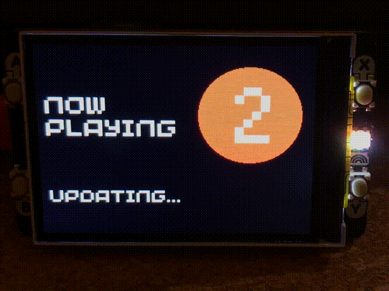

# BBC Radio "What's On" Display for Pimoroni Pico Display Pack 2


# Introduction

TODO

# Shopping List

TODO

# Try it!

TODO

## Assemble the Hardware

TODO

## Install Pimoroni MicroPython on the Raspberry Pi Pico W

TODO

## Get the Code

TODO

## Network Configuration

You will need to add your wifi SSID and password to the `secrets.py` file.  Edit `secrets.py` and replace the template content with the correct values for your network:

```python
WIFI_SSID = "Your wifi network name..."
WIFI_PASSWORD = "Your wifi password..."
```

Save your changes.

## Radio Station Configuration

TODO

## Copying the Code to the Raspberry Pi Pico W

TODO

## Running the Code

TODO

# How Does it Work?

TODO

# Have Fun!

Hopefully you find this a useful little project and a good demonstration of how to get some data from a JSON endpoint on the internet, display it on the Display Pack 2 and react to button presses on the device.  If you get this running or use it as a start point for your own project I'd love to hear from you.  Reach out to me using one of the methods on my website's [contact me](https://simonprickett.dev/contact/) page.

# Problems?

If you've found a bug or are having trouble getting started, please raise a [GitHub issue](https://github.com/simonprickett/pico-display-pack-2-radio-whats-on/issues) in this repository and I'll try and get back to you.  Have you improved on this project?  Feel free to submit a [pull request](https://github.com/simonprickett/pico-display-pack-2-radio-whats-on/pulls).